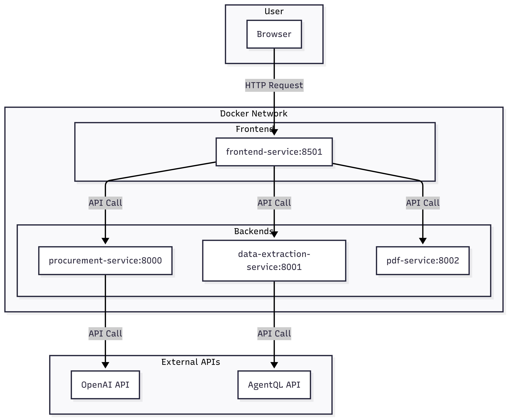

# **🤖 AI-Powered Procurement Assistant**

This is an advanced, end-to-end procurement workflow application built on a microservices architecture. This tool streamlines the entire procurement process, from generating a Request for Quote (RFQ) with AI to creating the final Purchase Order (PO).

Demo : https://ai-procure-app-kanokpon.streamlit.app/

## **✨ Features**

* **AI-Powered RFQ Generation**: Utilizes a chatbot interface to define procurement needs and generate a professional, structured RFQ document.  
* **Intelligent Data Extraction**: Uploads vendor quotations in various formats (PDF, JPG, PNG) and uses the AgentQL API to automatically extract key information like line items, prices, and terms.  
* **AI Vendor Analysis**: Leverages OpenAI's GPT-4 to perform a comprehensive analysis of all vendor quotations, providing a clear recommendation and a detailed comparison report.  
* **Automated Purchase Order Creation**: Generates a professional Purchase Order for the selected vendor based on the initial RFQ and final analysis.  
* **PDF & Data Export**: Allows downloading of all generated documents (RFQ, Comparison Table, PO) as formatted PDFs and exporting the entire workflow data as a single JSON file.  
* **Webhook Integration**: Pushes complete procurement data to any external system or webhook for seamless integration.

## **🏗️ Architecture Overview**

This application uses a microservices architecture to ensure scalability, maintainability, and separation of concerns. The system comprises a Streamlit frontend and three dedicated backend services for handling business logic, data extraction, and PDF generation.


## **🛠️ Technology Stack**

* **Frontend**: Streamlit  
* **Backend**: FastAPI, Python 3.11  
* **AI & Machine Learning**: OpenAI GPT-4, AgentQL  
* **PDF Generation**: ReportLab  
* **Containerization**: Docker, Docker Compose

## **📋 Prerequisites**

Before you begin, ensure you have the following installed:

* Docker  
* Docker Compose

## **🚀 Setup & Installation**

Follow these steps to get the application running locally.

### **1\. Clone the Repository**
```
git clone https://github.com/chkano/ai-procurement-assist.git 
cd ai-procurement-assist
```

### **2\. Create Environment File for Backend Keys**

Create a .env file in the project's root directory. This file holds the API keys for the backend services.

\# .env  
```
OPENAI_API_KEY="your_openai_api_key_here"  
AGENTQL_API_KEY="your_agentql_api_key_here"
```

### **3\. Create Secrets File for Streamlit Frontend**

Streamlit requires a .streamlit/secrets.toml file for secrets management. Create the necessary folder and file:

\# From the root directory, run: 
`mkdir -p frontend-service/.streamlit`

Now, create a file named secrets.toml inside frontend-service/.streamlit/.

\# frontend-service/.streamlit/secrets.toml  
\# This file is needed by Streamlit, but the keys are passed to the backends via the .env file.  
```
OPENAI_API_KEY="your_openai_api_key_here"  
AGENTQL_API_KEY="your_agentql_api_key_here"
```

### **4\. Build and Run the Application**

Use Docker Compose to build the images and start all services. The \--build flag ensures that any changes you've made are included.
```
docker-compose up --build
```
The initial build may take a few minutes.

## **💻 Usage**

Once all containers are running, you can access the application in your web browser at:  
http://localhost:8501  
The application workflow is divided into five sequential steps, accessible from the sidebar:

1. **Generate RFQ**: Chat with the AI to create a Request for Quote.  
2. **Upload Quotations**: Upload vendor documents for data extraction.  
3. **Vendor Analysis**: Let the AI analyze the quotes and recommend a vendor.  
4. **Purchase Order**: Generate a PO for the selected vendor.  
5. **Export & Integration**: Download all data or send it to a webhook.

## **🧩 Services Overview**

The application is composed of four distinct services that run in separate Docker containers.

| Service | Internal Port | Host Port | Purpose |
| :---- | :---- | :---- | :---- |
| frontend-service | 8501 | 8501 | Serves the Streamlit user interface and orchestrates API calls. |
| procurement-service | 8000 | 8001 | Handles all business logic and communication with the OpenAI API. |
| data-extraction-service | 8001 | 8002 | Manages data extraction from documents via the AgentQL API. |
| pdf-service | 8002 | 8003 | Generates all PDF documents for RFQs, POs, and reports. |

## **📄 License**

This project is licensed under the MIT License. See the LICENSE file for more details.
